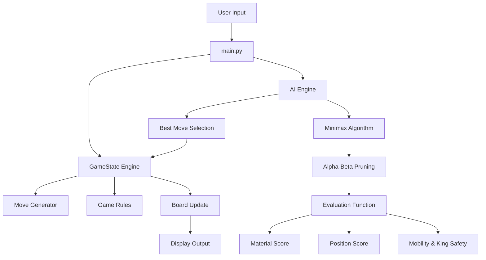
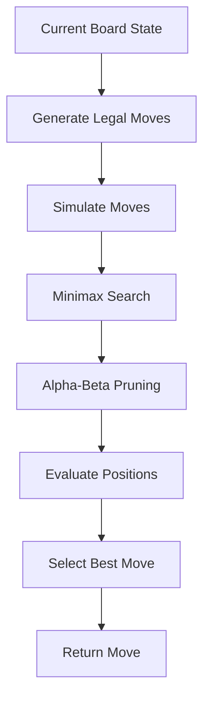

<p align="center">


</p>

<p align="center">


</p>

---

<h1 align="center">♟️ Chess AI with Forced Advantage</h1>

<p align="center">
A powerful adversarial AI system built using Minimax and Alpha-Beta Pruning.
</p>

---

## Overview

This project implements a **full chess engine and AI opponent** built in Python for **CS50’s Introduction to AI with Python**.

The system introduces **three distinct gameplay modes**:

- 🎯 **Fair Mode** — balanced AI gameplay  
- 🔥 **Hard Mode** — stronger AI with deeper reasoning  
- ♟️ **Forced-Win Mode** — AI starts from a theoretically winning position  

Unlike traditional claims of “solving chess”, this project focuses on:

> **Adversarial search, heuristic evaluation, and strategic decision-making in complex environments.**

---

## Key Highlights

- ♟️ Full chess engine with legal move validation  
- 🧠 AI powered by Minimax + Alpha-Beta pruning  
- 🎯 Forced-Win mode using winning endgame positions  
- 📊 Advanced heuristic evaluation system  
- 🔁 Turn-based adversarial reasoning  
- 💡 AI move explanations for transparency  

---

## 🎮 Game Modes

| Mode | Description |
|------|------------|
| **Fair Mode** | Balanced AI with limited search depth |
| **Hard Mode** | Strong AI with deeper search and positional evaluation |
| **Forced-Win Mode** | AI starts from a winning position and converts advantage |

---

##  System Architecture



---

## AI Decision Process


---

## Project Structure 

```
chess_ai/
│
├── main.py               # Game loop and UI
├── engine.py             # Core chess logic
├── ai.py                 # Minimax + Alpha-Beta
├── evaluation.py         # Heuristic evaluation
├── forced_positions.py   # Winning setups
├── utils.py              # Helpers & display
└── README.md
```

---

## AI Techniques Used

#### 1. Minimax Algorithm 
Simulates future game states assuming optimal play from both sides

#### 2. Alpha-Beta Pruning 
Optimizes search by eliminating unnecessary branches

#### 3. Heuristic Evaluation
Positions are evaluated using:
- Material balance
- Piece-square tables
- Center control
- Pawn structure
- Mobility
- King positioning

---

## How to Run

```
python main.py
```

---

## Move Input Format 

|**Example**|**Meaning**|
|-----------|-----------|
|```e2e4```|Move piece from e2 → e4|
|```g1f3```|Knight move|
|```e7e8q```|Pawn promotion|

#### Casting 

- ```e1g1``` → White kingside
- ```e1c1``` → White queenside
- ```e8g8``` → Black kingside
- ```e8c8``` → Black queenside

---

## Game Preview 


---

## Educational Value

This project demonstrates:
- Adversarial search in complex environments
- Decision-making under uncertainty
- Trade-offs between depth and computation
- Strategic reasoning in game theory

---

## ⚠️ Important Note
This project does NOT claim to solve chess.

Instead, it demonstrates:
> How an AI can dominate through superior search and evaluation, and guarantee wins in pre-defined winning scenarios.

---

## Future Improvements
- Graphical UI (Pygame / Web)
- Opening book integration
- Iterative deepening
- Transposition tables
- AI vs AI mode
- Move timers
- Save/load games

---
## Author
Nomusa Shongwe

---

## Final Thought
> This project is not just a chess engine; it is a demonstration of how AI thinks, evaluates, and wins.
