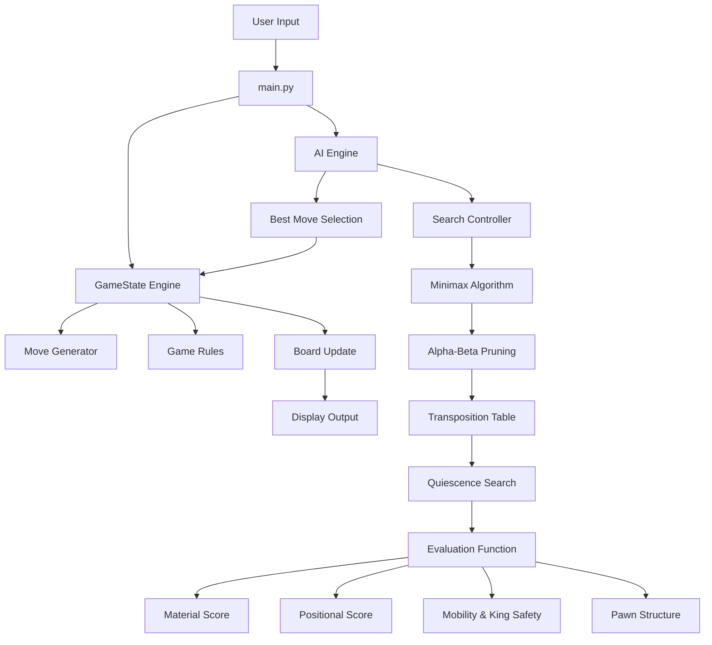
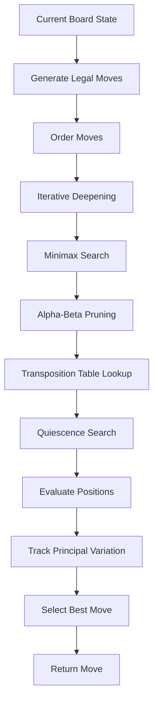

<p align="center">


</p>

<p align="center">


</p>

---

<h1 align="center">♟️ Chess AI with Forced Advantage</h1>

<p align="center">
A deep, explainable chess engine built with adversarial search, advanced evaluation, and transparent AI reasoning.
</p>

<p align="center">
Built for <strong>CS50’s Introduction to AI with Python</strong>
</p>

---

## Overview

This project is a **terminal-based Chess AI engine** designed to demonstrate how classical AI techniques can produce strong, explainable decision-making.

Unlike basic chess implementations, this engine combines:

- Minimax + Alpha-Beta pruning  
- Quiescence search  
- Principal variation tracking  
- Advanced evaluation heuristics  
- Explainable AI output  
- Full test coverage  

It is not just a game — it is a **transparent decision-making system**.

---

## Key Features

### Chess Engine
- Legal move generation
- Check / checkmate / stalemate detection
- Castling, en passant, promotion
- Undo move functionality
- Draw by repetition

### AI Engine
- Minimax search
- Alpha-Beta pruning
- Iterative deepening
- Quiescence search
- Move ordering
- Principal variation tracking
- Search diagnostics (nodes, depth, pruning)

### Evaluation System
- Material balance
- Piece-square tables
- Center control
- Pawn structure (doubled, isolated, passed, chains)
- Bishop pair bonus
- Rook file + 7th rank bonuses
- Knight outposts
- King safety (pawn shield)
- Mobility
- Game phase awareness
- Endgame king activity
- Edge pressure

### Explainable AI
- Why the move was chosen
- Evaluation breakdown
- Before/after evaluation delta
- Top candidate moves
- Principal variation

---

## Game Modes

| Mode | Description |
|------|-------------|
| **Fair** | Balanced gameplay |
| **Hard** | Stronger positional AI |
| **Forced-Win** | AI starts with advantage and converts |

---

## System Architecture



---

## AI Decision Process



---

## Evaluation Breakdown

The engine evaluates positions using multiple components:
* **Material** → piece values
* **Piece-Square Tables** → positional placement
* **Center Control** → board dominance
* **Pawn Structure** → long-term stability
* **Mobility** → number of legal moves
* **King Safety** → pawn shield
* **Endgame Activity** → king positioning
* **Edge Pressure** → forcing king to edge

---

## Explainability Example


---

## Project Structure
```
Chess-AI/
│
├── main.py
├── engine.py
├── ai.py
├── evaluation.py
├── forced_positions.py
├── utils.py
│
├── tests/
│   ├── test_engine.py
│   ├── test_evaluation.py
│   └── test_forced_positions.py
│
├── assets/
│   └── game.jpg
│
├── requirements.txt
├── .gitignore
└── README.md
```

---
## How to Run
```
git clone https://github.com/Nomusa990822/Chess-AI.git
cd Chess-AI
pip install -r requirements.txt
python main.py
```
### Run Tests

```pytest```

---

## Preview 


---

## What This Project Demonstrates
* Adversarial search (Minimax)
* Search optimization (Alpha-Beta)
* Tactical extensions (Quiescence)
* Heuristic evaluation design
* Explainable AI systems
* Clean modular architecture
* Software testing practices

---

## Important Notes
* Scores are from White’s perspective
  - Positive → White advantage
  - Negative → Black advantage
* Search evaluation ≠ static evaluation
  - Search includes lookahead
  - Static evaluates current position only
---

## Future Improvements
* Opening book
* Killer move heuristic
* Zobrist hashing
* GUI version (Pygame/Web)
* AI vs AI mode
* PGN export

---
## Author
Nomusa Shongwe

---
## Final Note
> This project shows that powerful AI does not require machine learning — it can emerge from structured reasoning, search, and well-designed evaluation.
