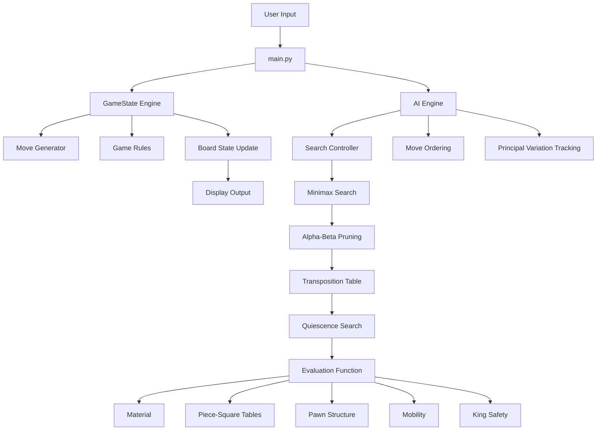

# Chess AI System Architecture

## Overview

This project follows a **layered AI system architecture** designed to separate:

- game rules
- search logic
- evaluation
- user interaction

This separation ensures:
- maintainability
- scalability
- testability
- clarity of responsibility

---

## High-Level Architecture



---

## Architectural Layers
### 1. Presentation Layer

**Responsibility:**
* user interaction
* game flow control
* rendering board
* displaying AI insights

Files:
* ```main.py```
* ```utils.py```
---

### 2. Game Control Layer

**Responsibility:**
* coordinates turns
* switches between player and AI
* handles game termination

**Key role:** Acts as the orchestrator of the system.

---

### 3. Chess Engine Layer (```engine.py```)

**Responsibility:**
* generates legal moves
* enforces rules of chess
* updates board state
* detects:
  - check
  - checkmate
  - stalemate
  - repetition

**Key Insight:** This layer is deterministic and rule-based; no AI here.

---

### 4. Search Layer (```ai.py```)

**Responsibility:**
* explores possible futures
* chooses best move using adversarial search

**Core Components:**
* minimax recursion
* alpha-beta pruning
* iterative deepening
* move ordering
* quiescence search
* principal variation tracking

---

### 5. Evaluation Layer (```evaluation.py```)

**Responsibility:**
* scores positions numerically

**Key Principle:** Transforms board states into decision signals.

---

### 6. Scenario Layer (forced_positions.py)

**Responsibility:**
* provides curated positions
* used for forced-win mode

---

### 7. Testing Layer (tests/)

**Responsibility:**
* validates correctness of:
  - engine
  - evaluation
  - forced scenarios

---

## Data Flow


---

## Design Principles

**1. Separation of Concerns**
> Each module has a single responsibility.

**2. Deterministic Core + Heuristic Intelligence**
> * engine = exact rules
> * AI = probabilistic reasoning via heuristics

**3. Explainability First**

Unlike black-box systems, this engine:
> * exposes reasoning
> * shows evaluation breakdown
> * explains decisions

**4. Extendability**
Future upgrades can be added without breaking structure:
> * opening books
> * Zobrist hashing
> * GUI
> * ML evaluation

---
## Trade-offs
| **Design Choice** | **Benefit** | **Cost** |
|-------------------|-------------|----------|
| Handcrafted evaluation | Interpretability | Requires tuning |
| Minimax search | Optimal decision framework | Exponential complexity |
| Quiescence search | Tactical stability | Extra compute |
| Modular architecture | Clean design | Slight overhead |

---

## Summary

This architecture reflects a classical AI system:
* rule-based environment
* adversarial reasoning
* heuristic evaluation
* explainable outputs

> It demonstrates how structured reasoning can produce strong intelligence without machine learning.
