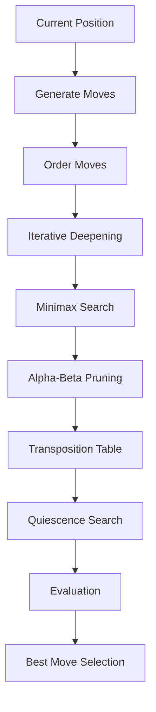

# Search & Decision-Making Notes

## Overview

The Chess AI uses **adversarial search** to determine the best move.

It assumes:
> Both players play optimally.

The search process explores future positions and evaluates them to choose the most favorable outcome.

---

## Core Search Flow



---

## Minimax Algorithm

Minimax models chess as a two-player zero-sum game.
* Max player (White) → maximize score
* Min player (Black) → minimize score

**Recurrence:**

> max(node) = max(child values)
> min(node) = min(child values)

---

## Alpha-Beta Pruning
Reduces the number of nodes explored.

**Key Idea:**
Skip branches that cannot influence the final decision.
* Alpha = best value for maximizer
* Beta = best value for minimizer

If:
```
alpha ≥ beta → prune branch
```

---

## Iterative Deepening

Instead of searching to full depth immediately:
* search depth 1
* then depth 2
* then depth 3...

**Benefits:**
* always has a usable move
* improves move ordering
* supports time control

---

## Move Ordering

Strong moves are searched first to improve pruning.

Typical ordering:
* captures
* checks
* promotions
* killer moves (future upgrade)

---

## Quiescence Search

**Problem: Horizon Effect**
The engine might stop searching in unstable positions.

**Solution:**
Extend search for:
* captures
* tactical sequences

Until position becomes quiet.

---

## Transposition Table

Caches previously evaluated positions.

**Benefits:**
* avoids recomputation
* speeds up search
* improves pruning

---

## Principal Variation (PV)

The PV is the engine’s best predicted line of play.

**Example:**
```
d7d5 → e2e3 → e7e5
```

---

## Evaluation Function

At leaf nodes, positions are scored using:
* material
* positional factors
* pawn structure
* mobility
* king safety
* game phase

---

## Decision Pipeline

1. Generate legal moves
2. Simulate each move
3. Explore future positions
4. Evaluate resulting positions
5. Compare scores
6. Choose best move

---

## Limitations

**1. Exponential Growth**

Search complexity grows rapidly:
```
O(b^d)
```
Where:
* b = branching factor (~35 in chess)
* d = depth

**2. Horizon Effect**

Even with quiescence, long-term tactics may be missed.

**3. No Learning**

The engine does not adapt or learn from games.

---

## Future Improvements
* killer move heuristic
* history heuristic
* aspiration windows
* Zobrist hashing
* opening book
* endgame tablebases

---

## Key Insight

This system demonstrates that:
> Strong decision-making can emerge from structured search + evaluation.

Without neural networks, the engine can still:
* plan ahead
* evaluate positions
* explain decisions

---

## Conclusion

The search system is the core intelligence of the engine.

**It transforms:**
* a static board into
* a strategic decision

**by combining:**
* exploration (search)
* evaluation (heuristics)
* optimization (pruning)
